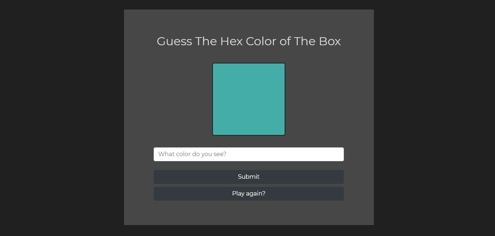

## Guess The Hexadecimal Color

A simple game in which the user must guess the correct hexadecimal color shown in the box.

You can play the game using the following link:

[Guess the hex color game](https://maryamaljanabi.github.io/guess-the-hex-color-js-game/)

In case you give up and want to know what color is being displayed, you can press F12. You will see the hexadecimal code of every color being generated.

## License

- MIT License
- Copyright 2020 © [Maryam Aljanabi](https://github.com/maryamaljanabi)
